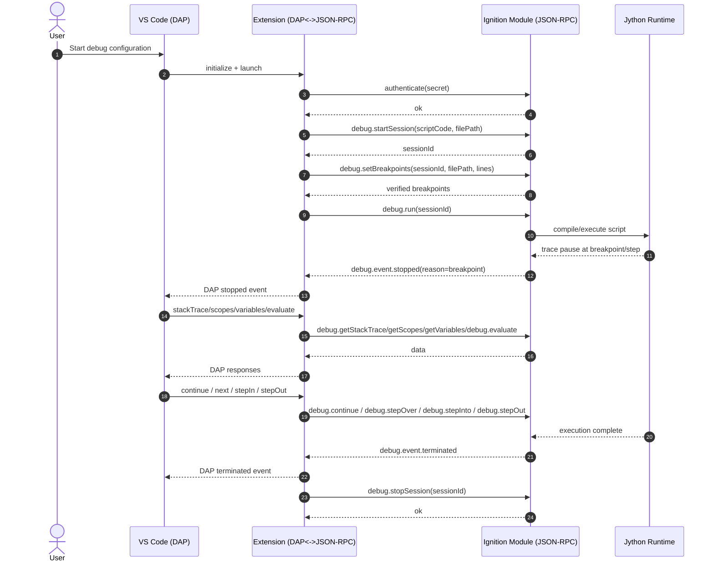
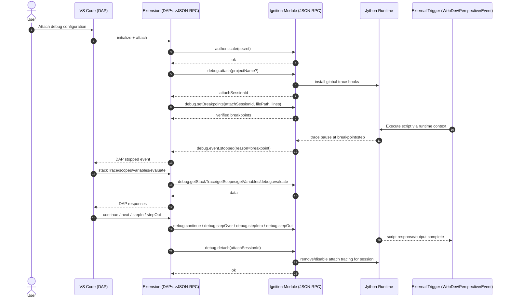
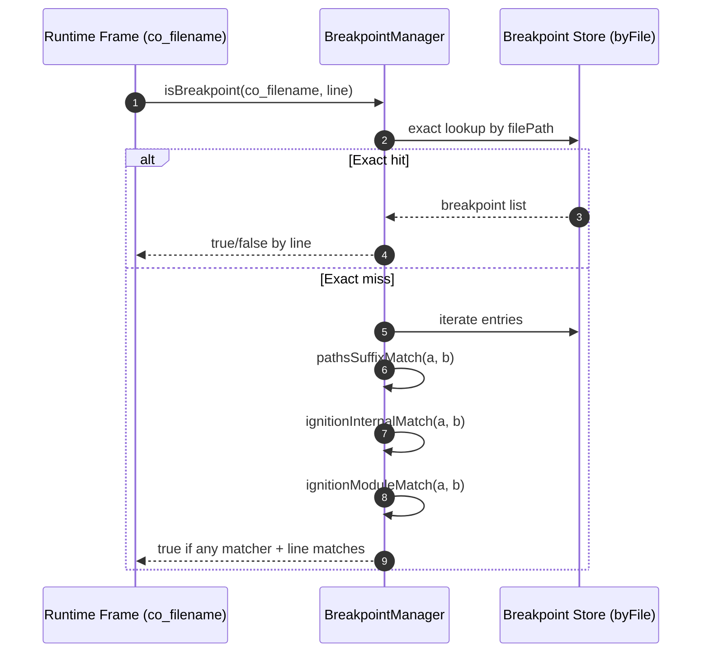

# Sequence Diagrams

This page provides machine-friendly and human-friendly sequence views of the debugger flows.

Conventions:

- `N:` prefix means ordered step number.
- `[...]` indicates state transitions.
- JSON-RPC method names are shown exactly.

## Actors

- User: Developer in VS Code UI
- VS Code: Debugger UI + DAP runtime
- Extension: Ignition debug adapter and connection services
- Module: Ignition module WebSocket server and debug engine
- Runtime: Jython execution environment inside Ignition

## Launch Mode Sequence

### Launch Mode State Model

1. `Disconnected`
2. `ConnectedUnauthenticated`
3. `Authenticated`
4. `SessionCreated`
5. `Running`
6. `Paused`
7. `Terminated`
8. `SessionStopped`

## Attach Mode Sequence

### Attach Mode State Model

1. `Disconnected`
2. `ConnectedUnauthenticated`
3. `Authenticated`
4. `Attached`
5. `WaitingForTrigger`
6. `Paused`
7. `Resumed`
8. `Detached`

## Breakpoint Filename Resolution Sequence

This shows how module-side matching resolves runtime filenames to user breakpoint file paths.

## Filename Formats and Matchers

1. Filesystem path
   - Example: `/.../resources/test/doGet.py`
   - Matcher: `pathsSuffixMatch`

2. WebDev internal function format
   - Example: `<<test-scripting/test:doGet>>`
   - Matcher: `ignitionInternalMatch`

3. Project library module format
   - Example: `<module:gateway_scripts>`
   - Matcher: `ignitionModuleMatch`

## AI Parsing Notes

To parse flow programmatically:

1. Use diagram `autonumber` as canonical event order.
2. Treat JSON-RPC method names as stable API identifiers.
3. Infer mode by presence of `debug.startSession` (launch) or `debug.attach` (attach).
4. Infer pause points by `debug.event.stopped` notifications.
5. Infer end-of-execution by `debug.event.terminated` (launch) or `debug.detach` completion (attach lifecycle).

## Compact Operation Matrix

This matrix provides a one-glance view of client action -> JSON-RPC call -> expected primary outcome.

| Client intent | JSON-RPC method | Primary expected outcome |
|---|---|---|
| Authenticate | `authenticate` | Auth success/failure result |
| Health check | `ping` | Status response |
| Launch session | `debug.startSession` | Launch session id |
| Attach session | `debug.attach` | Attach session id + tracing active |
| Set breakpoints | `debug.setBreakpoints` | Verified breakpoint list |
| Start launch execution | `debug.run` | Runtime begins script execution |
| Continue | `debug.continue` | Resume paused execution |
| Step over | `debug.stepOver` | Pause at next boundary |
| Step into | `debug.stepInto` | Pause in called frame boundary |
| Step out | `debug.stepOut` | Pause in caller boundary |
| Pause request | `debug.pause` | Best-effort stop transition |
| Read stack | `debug.getStackTrace` | Frame list |
| Read scopes | `debug.getScopes` | Scope list + references |
| Read variables | `debug.getVariables` | Variable list |
| Evaluate | `debug.evaluate` | Expression result string/value |
| End launch session | `debug.stopSession` | Launch session cleanup |
| End attach session | `debug.detach` | Attach session cleanup |

## Cross-References

- Protocol contract details: [debug-protocol.md](debug-protocol.md)
- Behavioral invariants: [reference.md](reference.md)
